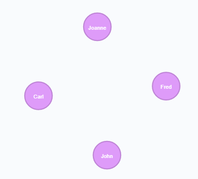

# Data Loading from a CSV file

## Data Modelling
The key to loading any data into the Graph is to understand the target datamodel, will your column create a new node or extend an existing node with a set of properties.   

###  Example

`PersonName,PersonEmail,PersonLocation`

The Person Name and Email would be considered properties of the node `Person`, whereas the `PersonLocation` would be better placed as a dedicated node within the database and thus allow you to create a limited set of unique locations and simply relate the `Person` to the `Location`

:bulb:Tip:bulb: 
Drawing your datamodel out as a set of circles and connections will help you understand the target model

## Preparing the CSV file
- Column headings should not include spaces
- Ensure there are no empty cells
- Place your CSV file into your `import` directory

## Writing the import script
- if importing into an existing dataset review the existing node and property names - ensure you are loading and matching against the same property names (name != Name)
- always merge - avoids duplicating data

### Simple create script
#### Example dataset
`PersonName,PersonEmail,PersonLocation` 
`John,john@dxc.com,UK` 
`Fred,fred@dxc.com,UK` 
`Joanne,jo@dxc.com,US` 
`Carl,carl@dxc.com,US`

[Download the Example Dataset](exampledata.csv)

~~~
LOAD csv with headers from "file:///exampledata.csv" as PersonData
MERGE (p:Person {name:PersonData.PersonName, email:PersonData.PersonEmail})
RETURN p
~~~

#### Breakdown of the `MERGE` statement
`p` = runtime variable within the query 
`Person` = name of the target node 
`{name:` = name of the target property within the node 
`PersonData` = friendly name given to the CSV file in the LOAD statement 
`PersonData.PersonName` = column name within the CSV file to select the property value from 
`email:` = name of the target property within the node 
`PersonData.PersonEmail` = column name within the CSV file to select the property value from 

#### Results

 

:bulb:Tip:bulb: 
Your CSV file can include data\columns not used in your load query - i.e. you can create a master CSV file and run multiple load scripts against it 

### Create and build a relationship
This query creates a set of unique location nodes and builds a relationship from the preloaded people to these locations

~~~
LOAD csv with headers from "file:///exampledata.csv" as PersonData
MERGE (l:Location {name:PersonData.PersonLocation})
WITH PersonData,l
MATCH (p:Person {name:PersonData.PersonName})
MERGE (p)-[:WORKS_AT]->(l)
RETURN p,l
~~~

#### Breakdown of the `LOAD` statement

1. `MERGE` - follows the same approach as before - check and create the location if it doesn't already exist
2. `WITH PersonData, l` - ensure the preloaded data is available for the next set of statements; `l` is carried forwarded as the newly created location node
3. `MATCH` - using the values within `PersonData` find the Person and Location information
4. `MERGE` - if no relationship exists between the 2 nodes, create the relationship

#### Results

 